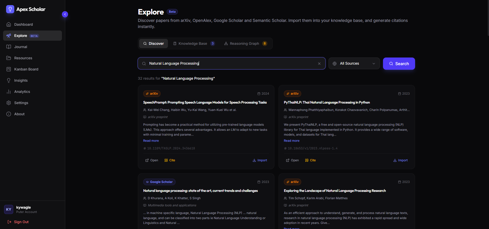

<div align="center">
  
  
  <h1>Apex Scholar</h1>
  
  <p>
    <strong>A unified, AI-powered workspace for academic researchers to explore literature, manage grants, and track knowledge.</strong>
  </p>

  <p>
    <a href="https://apex-scholar.vercel.app"></a>
    <a href="https://buymeacoffee.com/kywagle"></a>
  </p>
</div>

---

<div align="center">
  
</div>

## 📖 Overview

**Apex Scholar** bridges the gap between general data management and the specialized workflows of academic researchers. It provides a structured, highly customizable environment to discover literature, visualize conceptual gaps, manage citations, and track funding in a centralized dashboard.

## ✨ Key Features

- **Unified Papers Explorer:** Seamlessly search and import papers across **ArXiv**, **Semantic Scholar**, **OpenAlex**, **Google Scholar**, and **PubMed** simultaneously.
- **Knowledge Base & Gap Identification:** Auto-extract insights from abstracts using AI, and build an interactive 2D Force Graph to visualize relationships and identify novel research gaps.
- **Grant & Funding Tracker:** Stay on top of proposal deadlines, checklist requirements, document links, and budget spending.
- **Citation Engine:** Quickly auto-generate citations for your saved literature.
- **Kanban Task Board:** A drag-and-drop integrated board to map out your literature review, analysis, and data collection phases.
- **Cloud Backup & Restore:** Encrypted, secure storage via Puter.js integration ensuring your research data is always safe.

## 🚀 Getting Started

To run Apex Scholar locally on your machine, follow these steps:

### Prerequisites
- **Node.js** (v18 or higher recommended)
- **npm** or **yarn**

### Installation

1. **Clone the repository:**
   ```bash
   git clone https://github.com/sathwik-14/apex-scholar.git
   cd apex-scholar
   ```

2. **Install dependencies:**
   ```bash
   npm install
   ```

3. **Environment Setup:**
   Create a `.env` file in the root directory and add any required API keys (e.g., NCBI, SerpAPI, etc.):
   ```env
   SERPAPI_API_KEY=your_key_here
   NCBI_API_KEY=your_key_here
   ```

4. **Start the development server:**
   ```bash
   npm run dev
   ```

5. **Open the App:** Navigate to `http://localhost:3000` in your browser.

## 🗺️ Roadmap

We are constantly growing to meet the needs of the academic community. Here’s what’s on the horizon:

### Literature & Citation Management
- **Reference Syncing:** Native integrations with Zotero, Mendeley, and EndNote APIs.
- **PDF Workspace:** Upload papers, highlight text, and link annotations directly to your unified knowledge graph.
- **Scopus Integration:** Adding Scopus to the unified paper explorer.

### Deep AI Integrations
- **Document Q&A (RAG):** "Chat with your PDFs" to instantly summarize methodologies or findings across multiple uploaded papers.
- **Auto-Extraction:** AI-assisted extraction of tables, statistical values ($p$-values), and sample sizes directly into your dataset.
- **Smart Recommendations:** Context-aware literature discovery based on your current knowledge gap matrix.

### Collaboration & Open Science
- **Role-Based Access Control (RBAC):** Distinct permissions for Principal Investigators (PIs), Post-Docs, and Research Assistants.
- **Data Publishing:** 1-click publishing to make specific datasets or interactive visualizations public as supplementary materials.

## 🤝 Contributing

Contributions are welcome and greatly appreciated! If you have suggestions for adding new features or fixing bugs, please open an issue or submit a pull request.

## 📄 License

This project is open-source. Please see the `LICENSE` file for more details.

---
<div align="center">
  <p>Built with ❤️ for the research community.</p>
</div>
